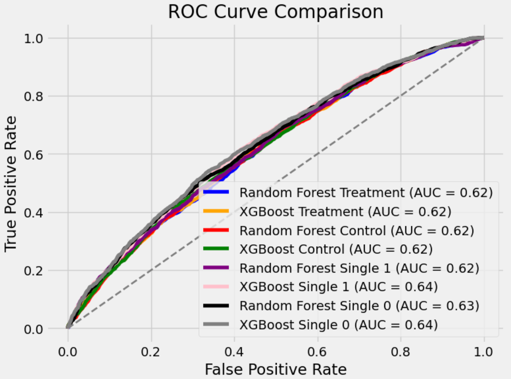

# Uplift Modeling(Casual Inference) for Email Marketing Campaign
## 1. Project Overview
This Project applies **uplift modeling** to evaluate the incremental effect of email marketing campaign using **Hillstrom Email Makreting dataset**. Instead of predicting response directly, the goal is to measure **causal impact**: 
- Who visits the website because of the email?
- Which customers would have visited anyway?
- which customers are negatively influence by emails(unsubscribe risk)?

The project compares **Two-Model(T-Learner)** and **Single-Model(S-Learner)** approaches, using **Random Forest** and **XGBoost**, with hyperparameter tuning by **Optuna**.
### ROC Curve

### Qini Score

## 2. Dataset
- **Source**: Hillstrom Email Marketing Dataset
- **Key Variables**:  
  - `segment`: treatment assignment (`Mens E-Mail`, `Womens E-Mail`, `No E-Mail`)  
  - `visit`: A binary indicator (`1/0 `), where 1 means customer visited the website within two weeks after sending email.
  -  `conversion`: A binary indicator (`1/0`), where 1 means customer purchased products within two weeks after sending email.
  - `spend`: The total amount spent wihtin two weeks after sending email. 
  - `history`, `recency`, `channel`, `zip_code`, etc. as user features  
- **Treatment Feature**:  
  - `treatment = 1` → Received Men’s Products Promotional Email (treatment group)
  - `treatment = 0` → no email (control group) 
-  **Target Variable**:`visit`(whether customer visited the website)

## 3. Data Preprocessing
- Filtered dataset to treatment(`Mens E-Mail`) and control(`No E-Mail`) group.
- Defined target variable：
   - `target = visit` 
- Feature Engineering:
  - Binned variables: purchase history(`low`,`medium`, `high`), recency(`low`, `medium`, `high`).
  - One-hot encoded categorical features(`zip_code`, `channel`, `history_segment`).
- Training and test set split:
  - Stratified sampling with `test_size=0.3` to ensure balanced treatment/control distrition and avois data leakage.

## 4. Modeling Approaches
### 4.1 Two-Model (T-Learner)
- Train **sperate models** for treatment group and control group.
- Uplift score = `P(Y=1 | treatment=1, X) - P(Y=1 | treatment=0, X)`
### 4.2 Single-Model (S-Learner)
- Train **one model** with treatment as an additional feature.
- Uplift score = `P(Y=1 | X, treatment=1) - P(Y=1 | X, treatment=0)`
### 4.3 Machine Learning Algorithms
- **Random Forest Classifier**
- **XGBoost Classifer**
- Hyperparameter tuning with **Optuna**, optimizing AUC by cross-validation.

## 5. Model Evaluation
- **AUC**: Checked classification performance within treatment and control groups.
- **Uplift Metrics**:
  - **Qini Curve**
  - **AUUC(Area Under Uplift Curve)**
- Interpretation: Models with higher AUUC identify customers where treatmetn truly changes behavior.

## 6. Results
- ROC AUC across models: 0.62-0.64, indicating reasonable classification performance.
- Qini Scores:
  - Two-Model RF: 0.0995
  - Two-Model XGBoost: 0.0947
  - S-Learner RF: 0.0986
  - S-Learner XGBoost: 0.0758
- **S-Learner Random Forest** achieved best performance(highest Qini Score).
- Top 20% customers ranked by uplift score showed **significant incremental lift** compared to random targeting.

## 7. Business Impact
- **Optimized Campaign Targeting**: Identified **top 20% customers** most likely to respond due to email, maximizing ROI.
- **Reduced Customer Fatigue**: Avoided sending emails to customers unlikely to respond, reducing unsubscribe/cancellation risk.
- **Precision Marketing**: Key findings shows that: 
  - **Medium-spending($200-$750)** and **recently active customers (1-4 months)** are the **most responsive**.
  - Customers with **men's/women's product purchase history** and **urban customers** also show strong positive impact.
  - **New customers** and those from **web/phone channels** show weak or even negative effects.

## 8. Technical Skills
- **Python**(pandas,numpy,matplotlib,seaborn,scikit-learn,xgboost,optuna)
- **Modeling**:Random Forest, XGBoost, Uplift Modeling(T-Learner, S-Learner)
- **Evaluation** :ROC-AUC, Qini Score, AUUC

